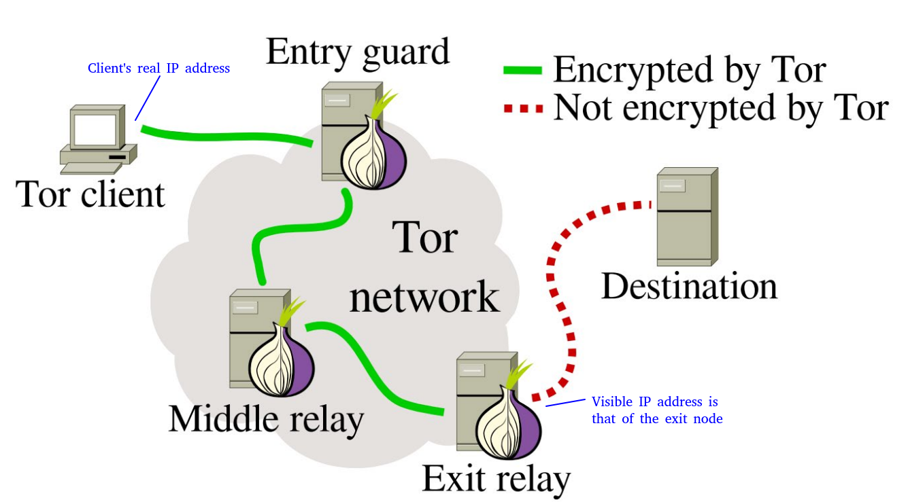
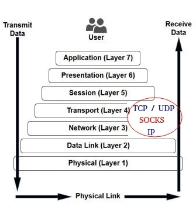
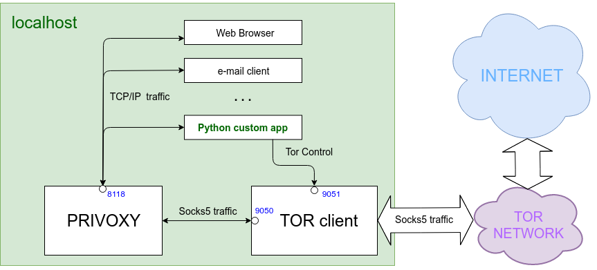

## Playing with Python in the deep web

### managing anonymity and hidden services in Tor network with Python

#### Intro

This repository contains some tips about Tor network and how to use it in your Python programs.

enjoy :)

### Table of contents

1. [Short introduction to Tor network.](#1)

2. [Tor agent installation (Ubuntu Linux) and configuration (torrc file).](#2)

3. [From SOCKS to HTTP: enhance Tor with Privoxy.](#3)

4. [Stem, Python's library for Tor agent managing and much more.](4)

    4.1 [Switching Tor circuit to get a new output IP address.](#4.1)

    4.2 [Select output IP address by country.](#4.2)

    4.3 [Building hidden services in Tor network.](#4.3)

#### <a name="1"></a>1. Short introduction to Tor network.

[Tor (The Onion Router)](https://www.torproject.org/about/overview.html) network is free software and open network that allows people to improve their privacy and security on the Internet.

Tor clients are connected to Tor network through an encrypted circuit. Each circuit is formed with three nodes [Entry]<->[Middle]<->[Exit].

Tor Client "visible" IP address will be the IP address from the exit node. In other words, Tor client will be hidden behind Tor circuit and is able to go through the Internet anonimously.




To know more about how Tor network works (recommended) visit [Tor website](https://www.torproject.org/about/overview.html#thesolution).

Tor can't solve all anonymity problems. _**Tor only protects your applications that are properly configured to send their Internet traffic through Tor**_. There are some threats regarding anonimity that can reveal your real identity like malicious [Javascript](https://www.torproject.org/docs/faq.html.en#TBBJavaScriptEnabled) in some websites, [DNS traffic monitoring](https://www.hackread.com/tor-dns-traffic-monitoring/) and some other third-party software.


#### <a name="2"></a>2. Tor client installation (Ubuntu Linux) and configuration (torrc file).

##### Installation

Tor client is available for Linux and OSX. Find full installation instructions at [installation guides section](https://www.torproject.org/docs/installguide.html.en) (left menu).

Installing Tor client in Debian/Ubuntu Linux is so easy:

`sudo apt-get install tor`

##### Configuration

By default Tor client uses port **9050 for SOCKS traffic**.

Controlling Tor client is possible by configuring *torrc* file in order to enable *ControlPort* option. This way, we can control Tor service from our Python programs.

We're going to configure our localhost Tor service like this:

  * SOCKS traffic port: **9050**

  * Control port: **9051**

  * Control Password: "**aVerySecurePassword**"

```bash
echo "RunAsDaemon 1" | sudo tee --append /etc/tor/torrc
echo "SOCKSPort localhost:9050" | sudo tee --append /etc/tor/torrc
echo "ControlPort localhost:9051" | sudo tee --append /etc/tor/torrc
echo "HashedControlPassword $(tor --hash-password aVerySecurePassword)" | sudo tee --append /etc/tor/torrc
sudo service tor restart 
```

Now our Tor service is runnig and we can control it through port 9051.


#### <a name="3"></a>3. From SOCKS to HTTP: enhance Tor with Privoxy.

Tor only works for TCP streams and can be used by any application with SOCKS support.

According to OSI model, [SOCKS protocol](https://tools.ietf.org/html/rfc1928) is an a intermediate layer between layer 3 (Network) and Layer 4 (Transport). Initially it was intended to be a way to pass traffic through firewalls. SOCKS v5 supports both transport protocols, TCP and UDP.



As you can figure out, not all applications can use Tor, because not all applications supports SOCKS. We can solve it by adding an a HTTP proxy server, like [Privoxy](https://www.privoxy.org/), to our system.

Our goal is to provide all applications access Tor network. This scheme shows how all these pieces fit together:



Privoxy full installation and configuration manual is available in [its website](https://www.privoxy.org/user-manual/index.html). For our purposes, it's enough with these few commands:

```bash
sudo apt-get install privoxy
echo "forward-socks5   /               127.0.0.1:9050 ." | sudo tee --append /etc/privoxy/config > /dev/null
sudo service privoxy restart
```

Now we're ready to play arround with Python in the deep web. But first, let's try it.

```bash
echo "IP real: $(curl --silent "http://ipecho.net/plain")" && echo "IP TOR (socks): $(curl --silent --socks5 127.0.0.1:9050 "http://ipecho.net/plain")" && echo "IP TOR (http): $(curl --silent --proxy http://127.0.0.1:8118 "http://ipecho.net/plain")"
```
First line will show our actual real public IP. Seccond and third commands must return same IP public address: our actual Tor network exit relay.


#### <a name="4"></a>4. Stem, Python's library for Tor agent managing and much more.

[Stem](https://stem.torproject.org/index.html) is a Python controller library for Tor. It uses Tor's Control Protocol over an a Tor agent.


##### <a name="4.1"></a>4.1 Switching Tor circuit to get a new output IP address.

Switching Tor circuit programmatically can be very useful. For example when runnign web scraping programs, pen-testing, etc...

Stem controller allows us to switch to an a new Tor circuit. It uses Tor Control Protocol.

Find an a example in [01_stem_switch_circuit.py](./src/01_stem_switch_circuit.py) script. It interacts with Tor service, running in localhost port 9051 and switchs Tor circuit by a new one. 

##### <a name="4.2"></a>4.2 Select output IP address by country.

A new tor instance can be raised from our Python programs. So, we don't need to have a Tor service running in our system. Instead of this, we launch Tor from our Python program with Stem.

Only one instance can be running at a time. But, despite that, it is a very powerful tool. All Controller options are available for stem library, things as selecting desired country for our "output relay" or switching tor circuit are so easy.

See [02_stem_launch_tor.py](./src/02_stem_launch_tor.py) sript for a detailed example.

##### <a name="4.3"></a>4.3 Building hidden services in Tor network.
